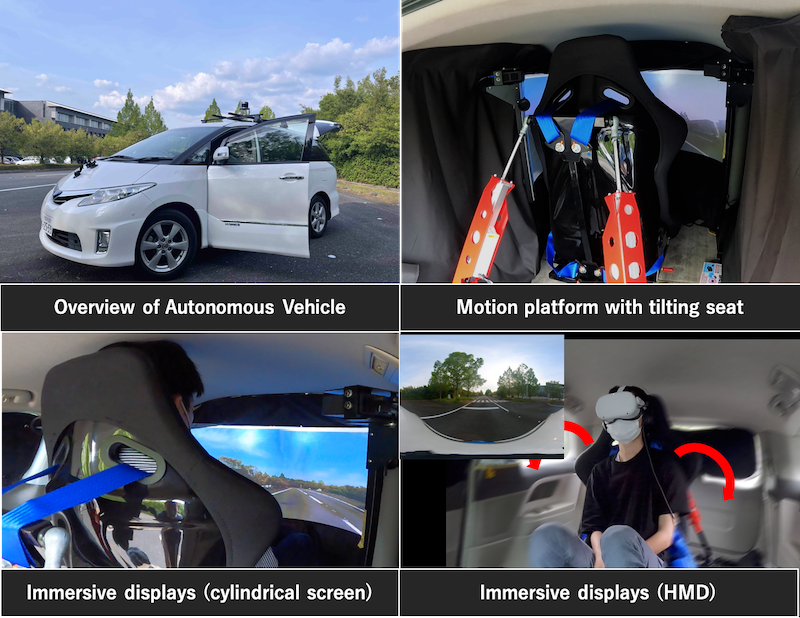

# Welcome to XRM

https://imdl.naist.jp/ja/wp-content/uploads/sites/2/2021/09/kk.png

## 快適自動走行のための XR モビリティプラットフォーム

快適な自動走行車を作るために、人の快適性を第一に考えた快適化知能の創造を目指す。自動走行ストレスや自動走行酔いなどの不快要因の推定や検出アルゴリズムの構築、不快要因の軽減や抑制手法である情報提示や挙動制御などの手法の効果検証を実車を用いて行う。XRモビリティプラットフォームという、自動走行機能を有し、没入型円筒ディスプレイやHMDより映像を出力し、モーションプラットフォーム座席による任意の傾きより、搭乗者が感じる移動感覚を消失させる（隠消現実）研究をしています。